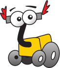
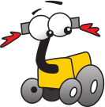
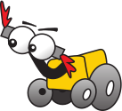
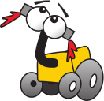
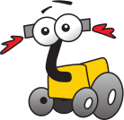
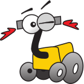
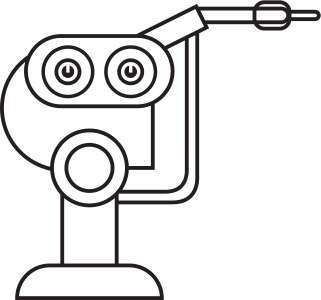
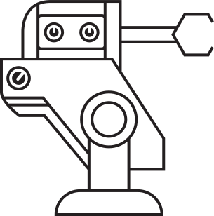
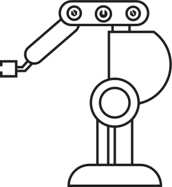

## Design

Make sure to follow these general guidelines:

- Read our [Design Manual](assets/pdf/Roberta_Manual_GCI.pdf).
- If you have Photoshop/Illustrator you can use it. Otherwise, [GIMP](https://www.gimp.org/) or [Inkscape](https://inkscape.org/) are good Open Source alternatives
- If your task does not specify a specific medium or requires you to be creative you can use any medium you want
- Please upload your resulting images in an appropriate format:
  - Photographs: JPG
  - Pixel-based digital art: PNG
  - Vector-based digital art: SVG/EPS/PDF
  - 3D: .obj + .mtl/.gltf (embedded)/.blend
- Upload your images using the [CC0](https://creativecommons.org/share-your-work/public-domain/cc0/) license
- Use the images linked below if your project requires it

### Images

#### Open Roberta Logo

#### Roberta Initiative Logo

#### Roberta

#### Sympathizer

#### Friends

#### Font

